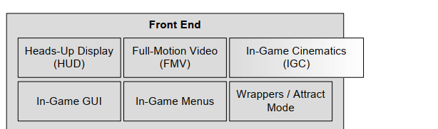

## (1.6) Runtime Engine Architecture

>自底向上的顺序大概为：
>硬件层 
>驱动层
> 系统层 
>ＳＤＫ层
＞平台独立层
> 核心库
>资源库 
>　渲染，调试，物理检测，游戏平台基础
＞游戏级渲染，各上层动画机制，相机机制，ＡＩ机制
＞游戏逻辑层

### 操作系统层

分为PC与主机（游戏）系统，PC系统如windows 提供了一种线程的机制为分享硬件资源，而主机游戏一般来说则可占用所有的硬件资源，但这两者的差距在逐渐减少。

>Operating systems like Microsoft
Windows employ a time-sliced approach to sharing the hardware with multiple running programs, known as preemptive multitasking. 
>On a console, the game typically
“owns” the entire machine.
>So the gap between console and PC development is
gradually closing (for better or for worse).

###  3rd Party SDKS

> DirectX Opengl
> Havok, PhysX ODE etc.. 实现增强物理效果的SDK
> Boost++ C++标准库之一
> STL C++标准库之一
> Kynapse 游戏AI开发的中间件
> Granny, Havok Animation，处理动画骨骼等
> Euphoria， 小型的游戏开发套件：https://sourceforge.net/projects/euphoriasdk/

#### 数据结构与算法

C++ 库
1. STL : strings, data structures, stream-based I/O  
2. STLport :portable and optimized of STL
3. Boost :Powerful data structures and algorithms library
4. Loki :Powerful generic programming template library

#### 图形

>硬件图形库
> Glide  早期的3D图形SDK，针对Voodoo显卡。
> OpenGL widely used!
> DirectX Microsoft's 3D graphics SDK
> libgcm   更底层的接口针对PS3的图形硬件，OpenGL更高效处理的选择。
> Edge Naughty Dog 和Sony提供的PS3平台的库

#### 物理与碰撞

> Havok industrial-strength physics and collision engine.
> PhysX  NVIDIA
> Open Dynamics Engine.  open source

#### 角色动画

> Granny:
> In my opinion, the Granny SDK
has the best-designed and most logical animation API of any I’ve seen,
commercial or proprietary, especially its excellent handling of time

> Havok Animation
>  The line between physics and animation is becoming
increasingly blurred as characters become more and more realistic.

> Edge  PS3 from Sony

#### 生物力学角色模型 Biomechanical Character Models

>Endorphin and Euphoria. These are animation packages that produce
character motion using advanced biomechanical models of realistic human movement.
> Endorphin, is a Maya plug-in that permits animators to
run full biomechanical simulations on characters and export the resulting animations as if they had been hand animated
>Euphoria, is a real-time version of Endorphin intended
to produce physically and biomechanically accurate character motion at runtime under the influence of unpredictable forces.

> Endorphin， MAYA插件，执行动作的角色将运行一个完整的生物力学模拟同时导出动画。
> Euphoria,  在一些不可预测的因素影响下，将动作更精细的模拟表现出来。
https://space.bilibili.com/430600560/channel/detail?cid=75669

### Platform Independence Layer

>the platform independence layer ensures consistent
behavior across all hardware platforms.

### Rendering Engine
> The rendering engine is one of the largest and most complex components of
any game engine.

#### Low-Level Renderer

> Graphics Device Interface
> DirectX, OpenGL

> The low-level renderer usually provides a viewport abstraction with an associated camera-to-world matrix and 3D projection parameters, such as field of view and the location of the near and far clip planes.

>  底层的渲染提供一个显示区域，关联到相机-世界和投影的参数。

#### Scene Graph / Culling Optimizations

> For very small game worlds, a simple frustum cull (i.e., removing objects
that the camera cannot “see”) is probably all that is required. For larger game
worlds, a more advanced spatial subdivision data structure might be used to
improve rendering efficiency by allowing the potentially visible set (PVS) of
objects to be determined very quickly. 

> potentially visible set (PVS)

> 理想状态下，底层渲染应该完全不关心spatial subdivision或scene graph的使用类型。 
>OGRE open source rendering engine (http://www.ogre3d.org) is a great example of this principle in action. OGRE provides a plug-and-play scene graph
architecture. Game developers can either select from a number of preimplemented scene graph designs, or they can provide a custom scene graph implementation.

### Front End

> HUD, Heads-up Display
> 在顶层显示
> FMV, Full-Motion Video 动作完整的视频回放
This system is responsible for playing full-screen movies that have been recorded earlier.
> IGC, in-game cinematics system.  游戏内的视频，一般当玩家不可操作时显示

### Profiling and Debugging Tools
>常用
• Intel’s VTune,
• IBM’s Quantify and Purify (part of the PurifyPlus tool suite), and
• Compuware’s Bounds Checker.

>However, most game engines also incorporate a suite of custom profiling
and debugging tools. For example, they might include one or more of the
following:
>* a mechanism for manually instrumenting the code, so that specific sections of code can be timed;
>* a facility for displaying the profiling statistics on-screen while the game
is running;
>* a facility for dumping performance stats to a text file or to an Excel
spreadsheet;
>* a facility for determining how much memory is being used by the engine, and by each subsystem, including various on-screen displays;
>* the ability to dump memory usage, high water mark and leakage stats
when the game terminates and/or during gameplay;
>* tools that allow debug print statements to be peppered throughout the
code, along with an ability to turn on or off different categories of debug
output and control the level of verbosity of the output; and
>* the ability to record game events and then play them back. This is tough
to get right, but when done properly it can be a very valuable tool for
tracking down bugs.

### Collisions & Physics

Collision and physics are usually quite tightly coupled. 
>* Havok is the gold standard in the industry today. It is feature-rich and
performs well across the boards.
>* PhysX by NVIDIA is another excellent collision and dynamics engine.
It was integrated into Unreal Engine 4 and is also available for free as
a stand-alone product for PC game development. PhysX was originally
designed as the interface to Ageia’s new physics accelerator chip. The
SDK is now owned and distributed by NVIDIA, and the company has
adapted PhysX to run on its latest GPUs.

>Open source physics and collision engines are also available. Perhaps the best-known of these is the Open Dynamics Engine (ODE)
>I-Collide, V-Collide and RAPID are other popular non-commercial collision detection engines. 开发于University of North Carolina
>http://www.ode.org

### Animations
>类型：
>* sprite/texture animation,
>* rigid body hierarchy animation, 
>* skeletal animation, 骨骼动画，
>* vertex animation， 顶点动画
>* morph targets.， 拉伸变形目标

### Human Interface Devices (HID)

input from the player , 玩家的输入设备
> keyboard, mouse
> joypad
> other specialized game controllers, like steering wheels, fishing rods,
dance pads, the Wiimote, etc.  方向盘，鱼竿，跳舞板，手柄控制器等

>The HID engine component is sometimes architected to divorce the lowlevel details of the game controller(s) on a particular hardware platform from the high-level game controls.
>It sometimes also includes a system for detecting
chords (multiple buttons pressed together), sequences (buttons pressed in sequence within a certain time limit) and gestures (sequences of inputs from the
buttons, sticks, accelerometers, etc.).
> HID engine 组件通常设计为划分出低等级的游戏控制器到高级游戏操作。
> 通常也会考虑检测组合按钮等情况

### Audio

Audio engines vary greatly in sophistication.
> For DirectX platforms (PC, Xbox 360, Xbox One), Microsoft provides an excellent audio tool
suite called XACT, supported at runtime by their feature-rich XAudio2 andX3DAudio APIs. 

>Electronic Arts has developed an advanced, high-powered
audio engine internally called SoundR!OT

>In conjunction with first-party studios like Naughty Dog, Sony Computer Entertainment America (SCEA) provides a powerful 3D audio engine called Scream

### Online Multiplayer/Networking

> Thatsaid, it is usually better to design multiplayer features from day one, if you
have that luxury

