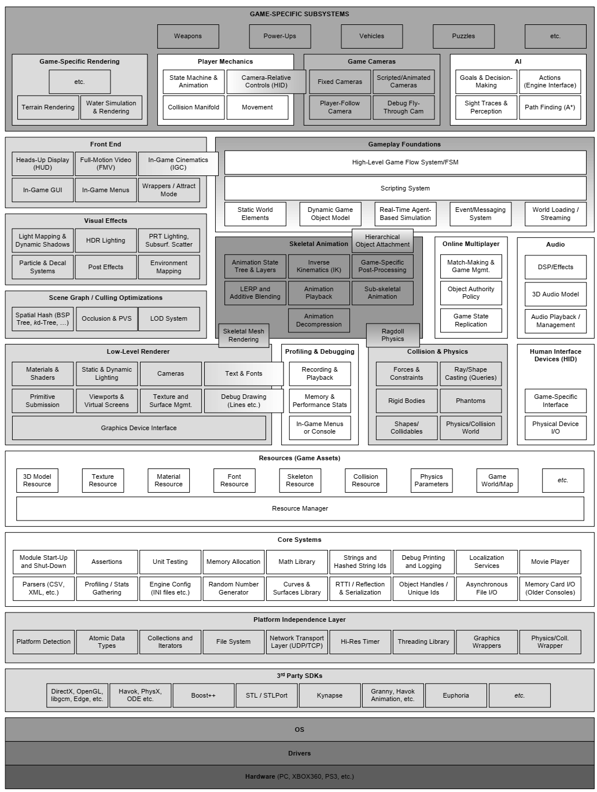

## (1.6) Runtime Engine Architecture

>自底向上的顺序大概为：
>硬件层 
>驱动层
> 系统层 
>ＳＤＫ层
＞平台依赖层 
> 核心库
>资源库 
>　渲染，调试，物理检测，游戏平台基础
＞游戏级渲染，各上层动画机制，相机机制，ＡＩ机制
＞游戏逻辑层

### 操作系统层

分为PC与主机（游戏）系统，PC系统如windows 提供了一种线程的机制为分享硬件资源，而主机游戏一般来说则可占用所有的硬件资源，但这两者的差距在逐渐减少。

>Operating systems like Microsoft
Windows employ a time-sliced approach to sharing the hardware with multiple running programs, known as preemptive multitasking. 
>On a console, the game typically
“owns” the entire machine.
>So the gap between console and PC development is
gradually closing (for better or for worse).

