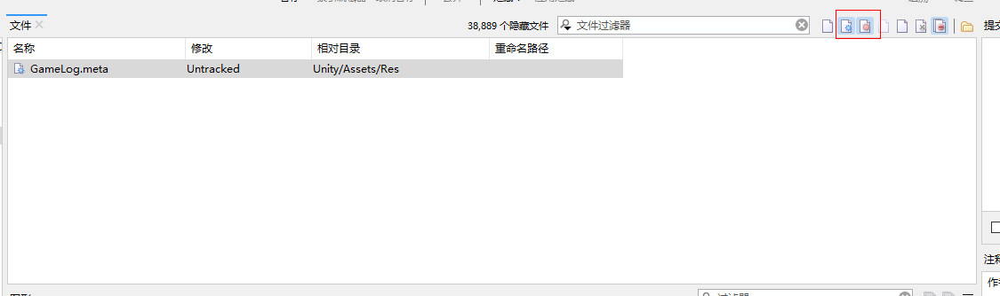

## 下载安装

* 打开网址：https://www.syntevo.com/smartgit/
* 如图，点击Download，进入后选择自己自己的系统平台

* 解压后，直接点击EXE文件安装，使用默认选项就行了。

## 第一次打开

1. 如果本地已经用过乌龟拉项目，smartgit会自动检测出项目，点击打开即可
2. 如果没有项目，请直接选择克隆新项目

## 切换分支
双击分支窗口的一个分支即可：

## 拉取最新

如果弹出窗口，选择“快进”的方式就可以了

## 提交更改
* 点亮来更改和新增的标识，来显示文件，如图：
 

* 选择自己的更改项，点提交并推送就行

## 建议

1. 提交前先点一下拉取，获取到最新的代码
2. 如果发现显示有问题，右击仓库窗口里的项目来刷新一下，如：

