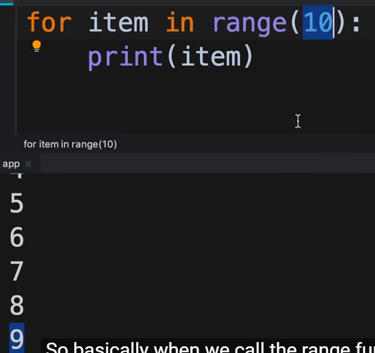
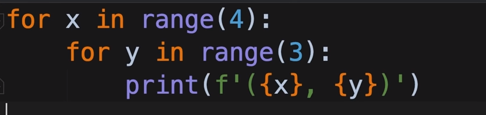
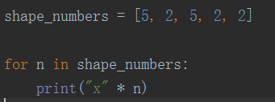

# Python杂项

## while结构
> 注： """  多行string


## For结构
> * 普通使用
> 
> * Use curly braces, 显示变量
>
> * 使用重复*个数输出字符
> 

## List
> * 普遍用法
```
names = ['John', 'Bob', 'Mosh', 'Sarah', 'Mary']
print(names[2:])  #Print will start from 'Mosh'''
print(names[:])  #Print all'
names[0] = 'Joh' #Change item
print(names)  #output
# 二维数组
matrix = [
    [1, 2, 3],
    [4, 5, 6],
    [7, 8, 9]
]
matrix[0][-3] = 20
print(matrix)
```