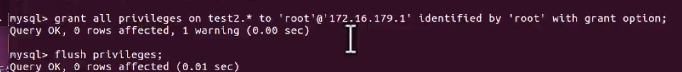

## 相关背景概念

> B2B, O2O, B2C, C2C..

## 数据库设计


> 对数据库进行授权
> 

> 使用后台管理
>


## 项目搭建

**1.一个模块对应一个APP**
**2.将所有app归类到一个apps文件夹**
**3.\[可选\]  设置一个系统路径，这样就不用注册APP时添加前缀文件夹**
	
``` python
sys.path.insert(0, os.path.join(BASE_DIR, 'apps'))
```

**4.添加templates包和static包**
>TEMPLATES_DIR = os.path.join(BASE_DIR, 'templates')
>TEMPLATES = [
    {
        'BACKEND': 'django.template.backends.django.DjangoTemplates',
        'DIRS': [TEMPLATES_DIR],
		...
> STATICFILES_DIRS = [os.path.join(BASE_DIR, 'static')]


**5.添加templates和static路径到setting**

**6.配置数据库为Mysql**

>   'ENGINE': 'django.db.backends.mysql',
        'NAME': 'dailyfresh',
        'USER': 'root',
        'PASSWORD':'bk102435',
        'HOST':'39.97.170.176',
        'PORT':3306,
	
**7.设置语言**

```python
LANGUAGE_CODE = 'zh-hans'
TIME_ZONE = 'Asia/Shanghai'
```

**8.配置项目总的urls**
**9.为各应用创建urls**

**10.数据层准备，创建db包，创建basemodel.py**

**11.\[可选\]创建各models 或 链接现有数据库**

> Inpectdb 也可针对某张表：
> python manage.py inspectdb TableName > output.py
> 链接： https://www.jianshu.com/p/037bd7e20a7a

**12.指定django认证系统的模型**
这样superuser的模型表就被指定到自己的user表
> settings.py中加入 
> AUTH_USER_MODEL = ‘user.User’

###  13.  可能出现的问题
不确定是不是使用pymysql导致的，这里会有两个问题
*  1.现在django使用mysqlclient，而且恶心的是会在启动时自动验证版本号，pymysql最高只到0.9.3。这里根据报错直接那代码注释即可！
*  2.makemigration出错，提示在django代码里的operations.py中的last_executed_query函数，由于python3与Python2的decode与encode函数区别，这里也需要把.decode..去掉。


## User模块 - 注册

**1.准备views函数**
* views.py添加相应函数
register函数为接收跳转网页, register_handler函数接收处理及逻辑

```python
def register():
	pass
def register_handle():
	pass
```

* urls.py配置对应view函数路径

```python
path('register',views.register,name='register')
path('register_handle',views.register_handle,name='register_handle')
```


**2.templates里放入html信息**

* 编辑表单\<form\>
	添加method,action.
	写法升级：

```python
action="" 
```

旧的写法:

```python
action = "/user/register_handle"
```

> 注意事项：
> 1. 网页使用跳转，需要在urls.py中指定name:
> 如下：所对应的地址段需要设置不同的正则
> 
> ```python
> path('add/', calc_views.add, name='add'),  # new
> path('add/<int:a>/<int:b>/', calc_views.old_add2_redirect,name='add'),
> ```
> 2.使用shell, 用reverse测试
> 地址反射的机制：django.urls reverse
> 3.定义一个跳转函数来做：
> 
> ```python
> urls.py中加入如下：
>  path('add/<int:a>/<int:b>/', calc_views.old_add2_redirect,name='add'),
> path('new_add/<int:a>/<int:b>/', calc_views.add2, name='add2'),
>
> views.py中加入如下：
> def old_add2_redirect(request):
> return HttpResponseRedirect(
>        reverse('add2', args=(a, b))
>    )
> 测试网址： http://127.0.0.1:8000/add/5/6/ 
> 这时最终就将跳到美术http://127.0.0.1:8000/new_add/5/6/
> ```


	
**3.使用类视图**

> 1.优化去register_handle函数，使用get/post判断实现不同的跳转类型
> 2.基于1的优化，使用类视图方式加载

```python
from django.views.generic import View

class RegisterView(View):

    def get(self, request):
        pass

    def post(self, request):
		pass
```

**3.激活用户**

1. 使用itsdangerous为网址进行加密签名
2. 调用django.core.mail 的send_mail来发送邮件，把链接成文本发送过去

```python
from django.conf import settings
from django.core.mail import send_mail
import time
def send_register_active_email(to_email, username, token):
    '''send active email'''
    subject = "天天生鲜欢迎消息"
    message = ""
    sender = settings.DEFAULT_FROM_EMAIL
    receiver = [to_email]
    html_message = "<h1>%s, 欢迎你</h1>请点击下面链接激活<br/><a href=\"http://127.0.0.1:8000/user/active/%s\">http://127.0.0.1:8000/user/active/%s</a>" % (
    username, token, token)
    send_mail(subject, message, sender, receiver, html_message=html_message)
    time.sleep(5)
```