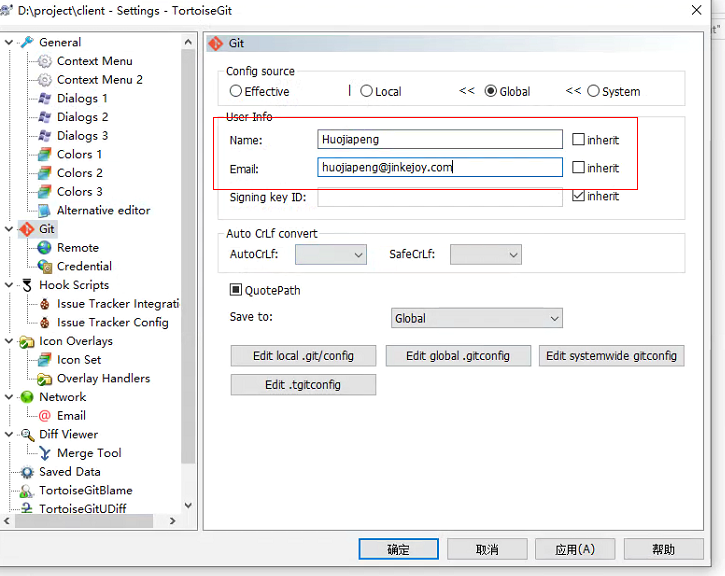

## 登录公司Gitlab注册账号
http://172.16.100.8:8081
注册完后将账号名发送给各小组负责人。

## 安装Git

以下网站里选择自己电脑平台，下载安装即可
https://git-scm.com/downloads
注：安装过程选择默认选项

## 安装Git工具

推荐使用乌龟工具，界面与之前的SVN近似，而且可以结合window文件系统。
https://tortoisegit.org/download/

注：安装过程选择默认选项

## 装好之后设置账号信息




## 克隆服务端的项目代码
>1.右键选择git clone. 
2.输入项目地址：http://172.16.100.8:8081/x1client/client.git 


## 切换到自己所在的分支
> 美术： art 
> 策划和程序： feature


## 【可选】用旧项目的library
>复制原SVN的UNITY目录下的library文件夹，粘贴到已经拉下来的unity目录下。这样重打开项目不用等待太多。

## 如何拉取


## 如何提交


## 日常工作流推荐
本地更改用一个新分支，提交之前可以去主工作分支rebase一个最新版，然后再提交本地，再切到主工作分支merge.

```
git branch 'my'
git checkout 'my'
# do some work
git add .
git commit -m 'my work done!'
git rebase -i feature #get latest feature branch commits
#fix conflict if needed
git checkout feature
git merge my #take care! use merge here
git push
```


注： 一定不要在主工作分支上执行rebase，这样会要求push --force的操作，这种操作将直接覆盖所有的其他人的提交，导致历史树的变更。